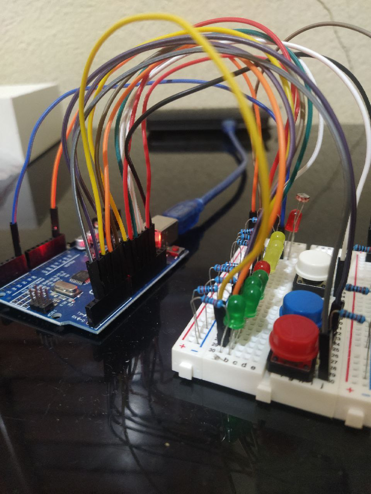
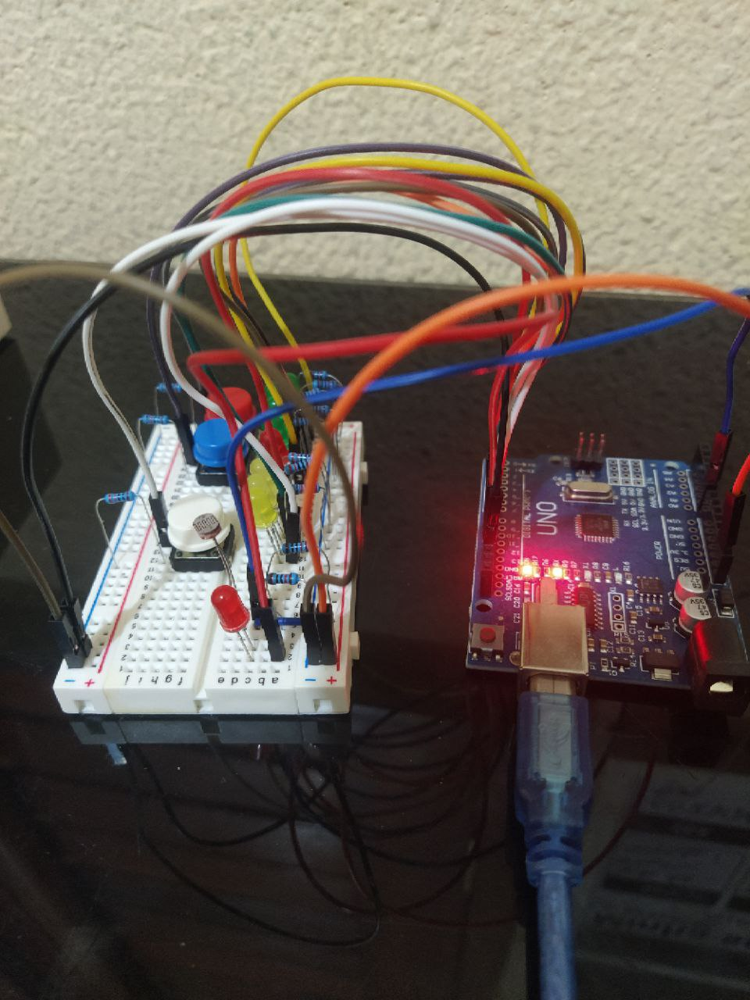
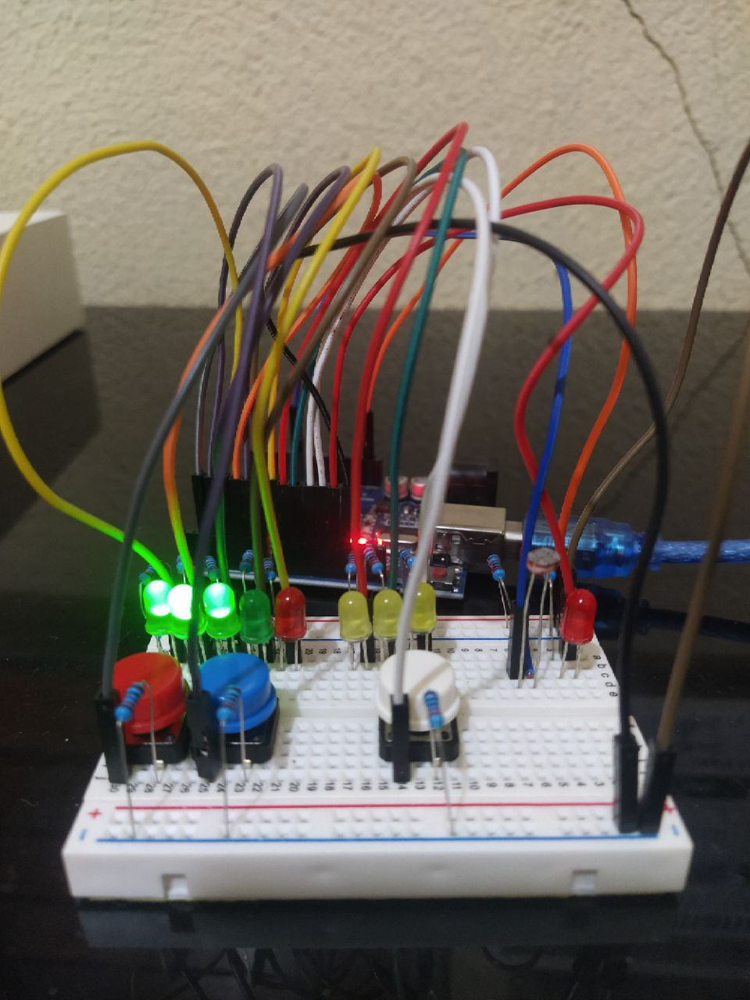
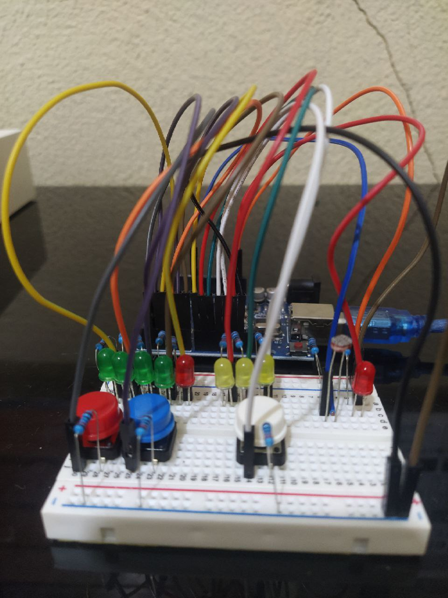

## O que foi implementado?
  Nesse projeto utilizei a biblioteca protothreads para rodar 3 protothreads em paralelo.
  ### 1º- Produtor/Consumidor(leds verdes)
  Nessa protothread, foi aplicado o problema do produtor/consumidor onde um botão faz o papel do produtor e outro do consumidor, quando um deles tenta fazer uma
  operação inválida(tentar consumir com o buffer vazio/tentar produzir com o buffer cheio) o led vermelho é acionado indicando bloqueio.

  ### 2º- Duração do tempo pressionado(leds amarelos)
  Nessa protothread foi aplicado um cronômetro para medir a duração do tempo em que o botão permanceu pressionado, com o passar do tempo ele começa a ligar os leds 1 a 1.

  ### 3º- Sensor de luz(led vermelho)
  Nessa protothread foi aplicado um photoresistor que vai funcionar como um sensor de luz nesse projeto, quando ele recebe pouca luz ou nada o led liga e 
  quando volta a receber luz o led apaga.

## Protothreads: Conceitos, Características e Aplicações

### O que são Protothreads:
Protothreads são uma técnica de programação leve e eficiente para sistemas embarcados. Desenvolvidos por Adam Dunkels, eles oferecem uma abordagem de programação de máquina de estados cooperativa para facilitar o desenvolvimento em ambientes com recursos limitados.

### Características Principais:

#### Leveza: Protothreads são projetados para serem leves em termos de recursos, sendo ideais para sistemas embarcados com restrições de memória e processamento, gastando apenas 2 bytes para cada protothread.

#### Cooperativos: Ao contrário de sistemas baseados em threads tradicionais, os protothreads são cooperativos, o que significa que a troca de contexto ocorre de maneira explícita, geralmente através de chamadas de função.

#### Máquina de Estados Simplificada: Protothreads simplificam a programação concorrente, permitindo que os desenvolvedores usem uma abordagem de máquina de estados finitos para estruturar o código.

#### Uso Eficiente de Recursos: Por utilizar uma pilha única compartilhada, os protothreads minimizam o consumo de memória, sendo uma escolha eficiente em ambientes com recursos limitados.

### Como Funcionam na Prática:

#### Rotinas de Continuação: Protothreads utilizam rotinas de continuação para manter o estado entre chamadas, permitindo que uma função seja retomada a partir de onde foi interrompida.

#### Chamadas de Função Simplificadas: A troca de contexto é feita de maneira explícita, muitas vezes por meio de chamadas de função, simplificando a lógica de programação.

#### Estrutura de Máquina de Estados: O código é estruturado como uma máquina de estados finitos, facilitando a compreensão do fluxo do programa.

# Referências
https://dunkels.com/adam/pt/index.html

https://www.youtube.com/watch?v=kNs2KyIlUUE&ab_channel=GustavoDenardin
